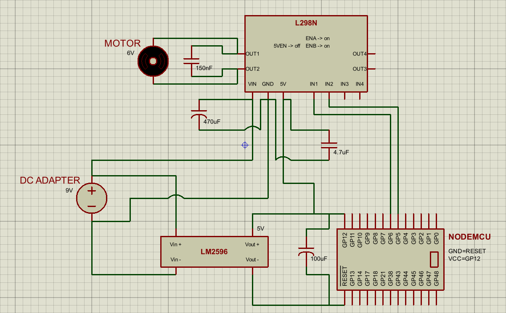
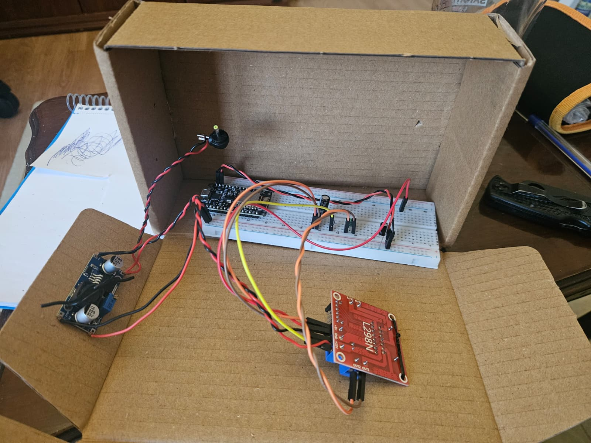
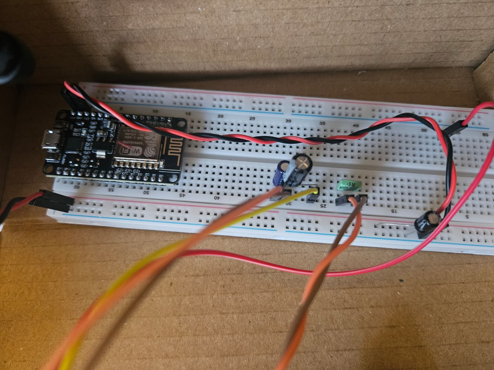
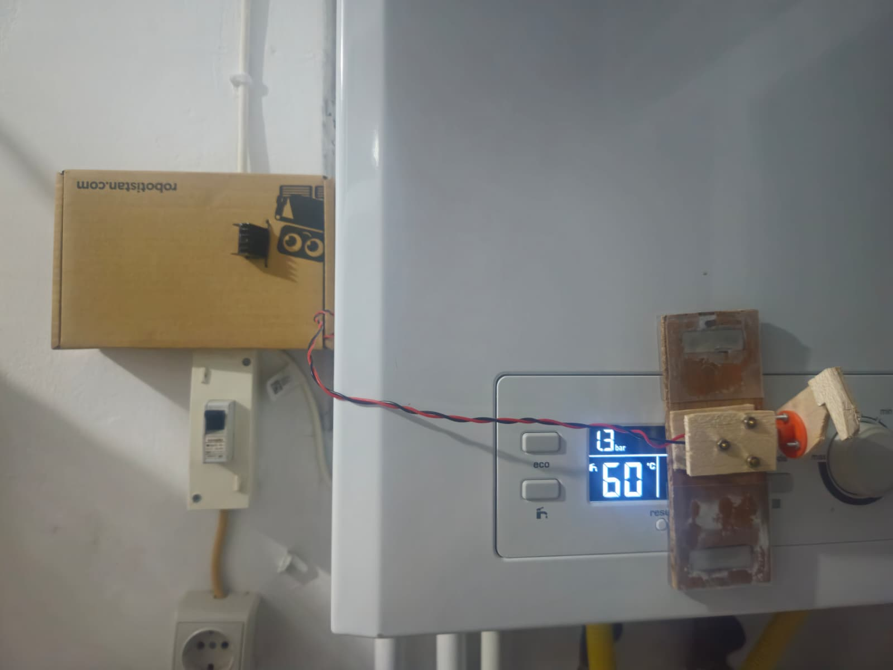

# Boiler-IoT

A smart, non-invasive DIY IoT solution for controlling an apartment boiler remotely. 

Because modifying the internal electronics of a boiler can be both dangerous and expensive, this project takes a completely non-invasive mechanical approach: a high-torque, low-RPM DC motor is physically mounted to press the existing control buttons on the boiler panel.

The system uses a **Raspberry Pi** as a UDP broadcaster to send commands over the local network, and a **NodeMCU (ESP8266)** as a receiver to drive the motor.

---

## Hardware Architecture

### Power Management Innovation
Standard motor drivers like the L298N draw significant quiescent current even when idle, draining power. To solve this, this circuit integrates an **IRF3205 N-channel MOSFET** as a high-side/low-side power gate. 

The NodeMCU keeps the MOSFET turned off by default, completely disconnecting the L298N from the power supply ground. The NodeMCU only pulls the MOSFET Gate `HIGH` when a command is received, switching the L298N on for a brief 3-second window to run the motor.

### Components List

| Part | Value / Model | Purpose / Notes |
| :--- | :--- | :--- |
| **Microcontroller** | NodeMCU (ESP8266) | Acts as the local Wi-Fi UDP receiver |
| **Server / Controller** | Raspberry Pi | Acts as the UDP network broadcaster |
| **Motor Driver** | L298N Module | Controls the direction of the DC motor |
| **Actuator** | Low-RPM, High-Torque DC Motor | Physically presses the boiler buttons |
| **Power Gate** | IRF3205 N-channel MOSFET | Cuts off L298N ground when idle to save power |
| **Gate Resistor** | 1 kΩ | Placed between NodeMCU GPIO and MOSFET Gate |
| **Power Supply** | Variable DC Power Supply | Powers the whole system |

### Wiring Connections

**Motor Control Signals:**
* NodeMCU `D1` -> L298N `IN1`
* NodeMCU `D2` -> L298N `IN2`

**Power Gate Circuit:**
* 9V DC `(+)` -> L298N `VCC`
* 9V DC `(-)` -> IRF3205 MOSFET `Drain` pin
* IRF3205 `Source` pin -> L298N `GND`
* NodeMCU `D3` -> 1kΩ resistor -> IRF3205 `Gate` pin
* NodeMCU `GND` -> 9V DC `(-)` (Establishes a common ground)

**Motor Output:**
* Motor terminals -> L298N `OUT1` and `OUT2`

---

## Visual References

### Hardware Schematic


### Physical Implementation
| Prototype Setup | Circuit Close-up | Final Installation |
| :---: | :---: | :---: |
|  |  |  |

---

## Firmware & Software Setup

### 1. NodeMCU Receiver Setup
1. Open the Arduino IDE and ensure you have ESP8266 board support installed.
2. Open `receiver.ino`.
3. Update the following lines with your local Wi-Fi credentials:
```cpp
   const char* ssid = "YOUR_SSID";
   const char* password = "YOUR_PASSWORD";

```

4. Connect the NodeMCU to your computer, select the correct board and port, and upload the sketch. No external libraries are required.

### 2. Raspberry Pi Sender Setup

1. Ensure Python 3 is installed on your Raspberry Pi.
2. Place the `sender.py` script on your Pi.
3. Find your network's broadcast address by running `ifconfig` (or `ip a`) in the terminal. Look for the `broadcast` value under your wireless interface (typically `wlan0`).
4. Open `sender.py` and replace `<broadcast>` with your network's actual broadcast address.

---

## Execution

1. Power on the NodeMCU and connect the 9V DC to the motor driver circuit.
2. Open a terminal on your Raspberry Pi and execute the sender script with the desired command argument:

```bash
   python sender.py "temp motor up"

```

or

```bash
   python sender.py "temp motor down"

```

The NodeMCU will receive the broadcast packet, activate the MOSFET to power the L298N, drive the high-torque motor in the specified direction for 3 seconds to press the button, and then safely power down the driver back into sleep mode. You can track execution details live via the Arduino IDE Serial Monitor.
